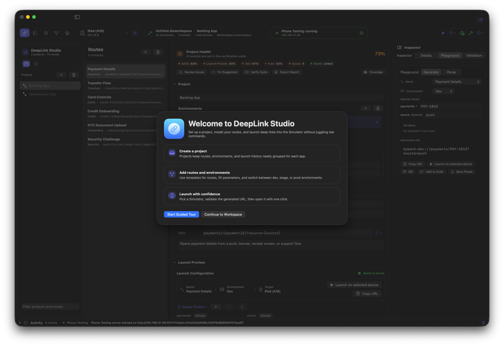
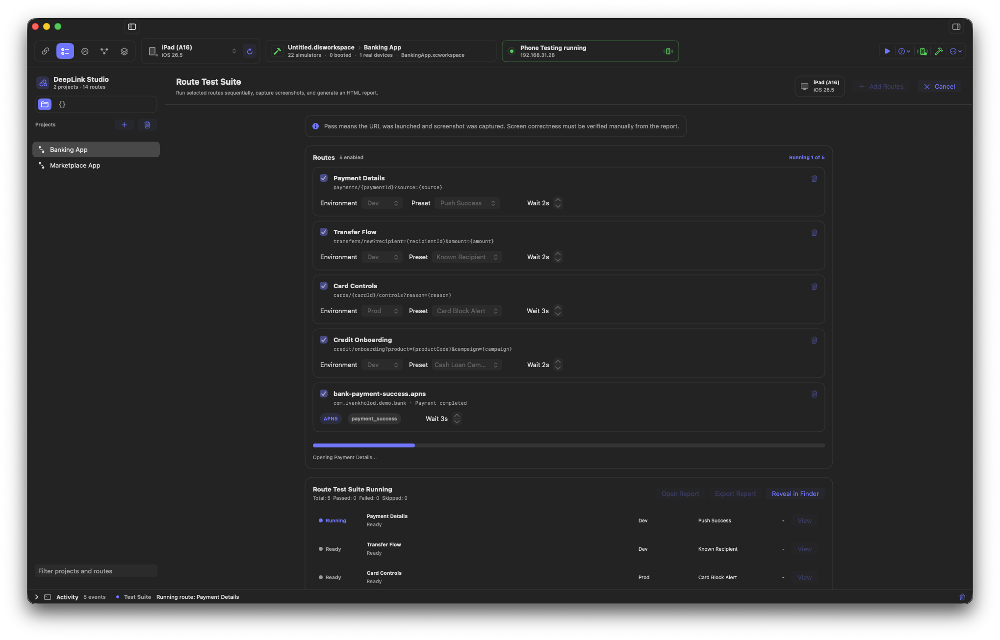
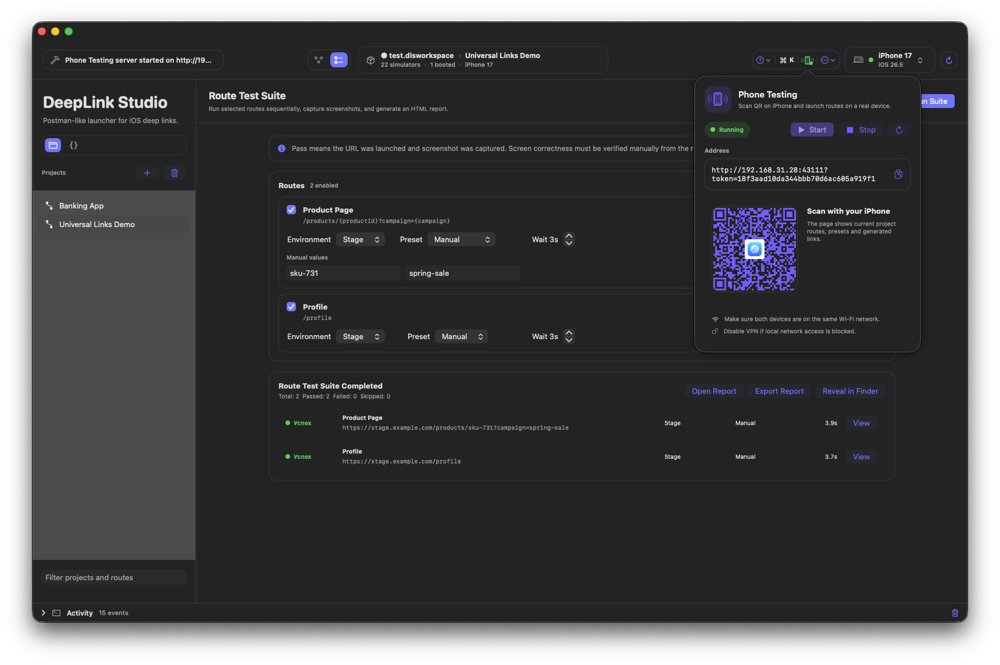
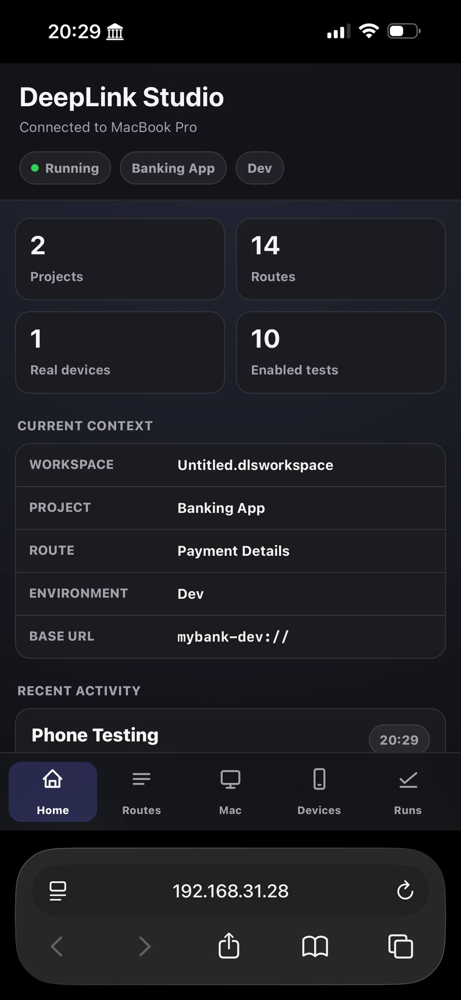

# DeepLink Studio

**A workspace for mobile deep links.**

DeepLink Studio is a macOS developer tool for managing, generating, validating and testing deep links across projects, environments, simulators and real devices.

<p align="center">
  
</p>

---

## Why

Most mobile teams manage deep links in:

- Confluence
- Notion
- Slack
- Wiki pages
- Text files

Launching them usually requires:

```bash
xcrun simctl openurl booted "myapp://product/123"
```

As applications grow, teams end up maintaining hundreds of routes across multiple environments, feature flags and testing scenarios.

DeepLink Studio provides a dedicated workspace for deep link management and testing.

---

## Features

### Workspace-first architecture

- Workspace files (`.dlsworkspace`)
- Recent Workspaces
- Auto Restore Last Workspace
- Import / Export
- Merge Workspace
- Route organization by projects
- Search across projects and routes

### Route management

- Create, edit and duplicate routes
- Route groups
- Drag & Drop ordering
- Environment-aware URL generation
- Validation and missing parameter detection
- Launch presets for repeatable scenarios

### Variables

Use variables similar to Postman:

```text
{{userId}}
{{productId}}
{{campaign}}
```

- Workspace variables
- Variable source tracking
- Usage references
- Automatic URL generation

### Simulator integration

- Automatic simulator discovery
- Open deep links directly in Simulator
- Auto Boot Simulator
- Runtime version detection
- Simulator filtering and search
- Copy UDID
- Reveal in Simulator.app
- Boot / Shutdown controls

### Real device testing

- QR generation for deep links
- Phone Testing Mode
- Local HTTP server
- Open routes on a real iPhone
- Route search from mobile browser
- Launch presets on device

### Route Test Suite

Run multiple deep links as a batch.

- Select routes
- Configure presets
- Configure environments
- Automatic screenshots
- Execution history
- HTML report generation

<p align="center">
  
</p>

---

## Phone Testing Mode

DeepLink Studio can expose routes through a local web server.

Scan a QR code from your iPhone and test routes on a real device without installing any companion app.

<p align="center">
  
</p>

<p align="center">
  
</p>

---

## Command Palette

Inspired by Xcode, Raycast and modern developer tools.

Shortcut:

```text
⌘K
```

Quick actions:

- Launch Route
- Copy URL
- Refresh Simulators
- Select Simulator
- New Route
- New Project
- Import Workspace
- Export Workspace

---

## Import & Export

DeepLink Studio supports:

- Workspace export
- Project export
- Route export
- Import preview
- Safe merge
- Explicit workspace replacement

Preview includes:

- File type
- Route count
- Project count
- Environment count

Before any destructive operation.

---

## Localization

Supported languages:

- English
- Russian

---

## Built With

- Swift 6
- SwiftUI
- AppKit
- Foundation
- UniformTypeIdentifiers
- simctl
- Network.framework

---

## License

MIT License
